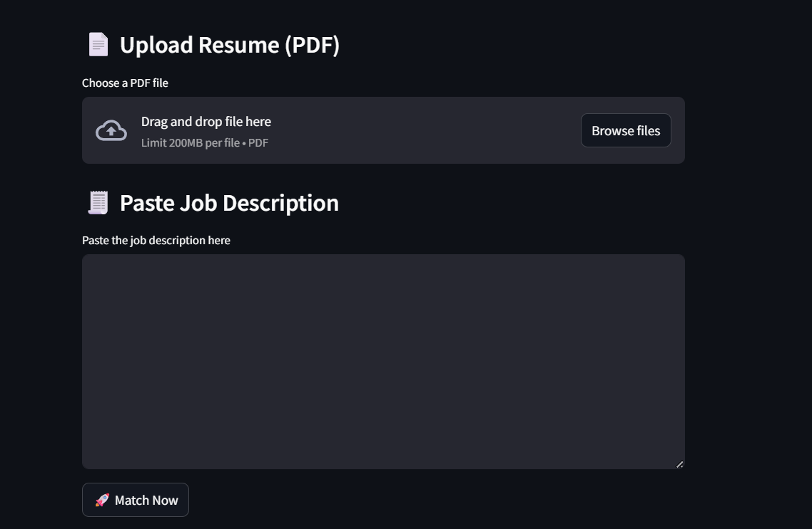
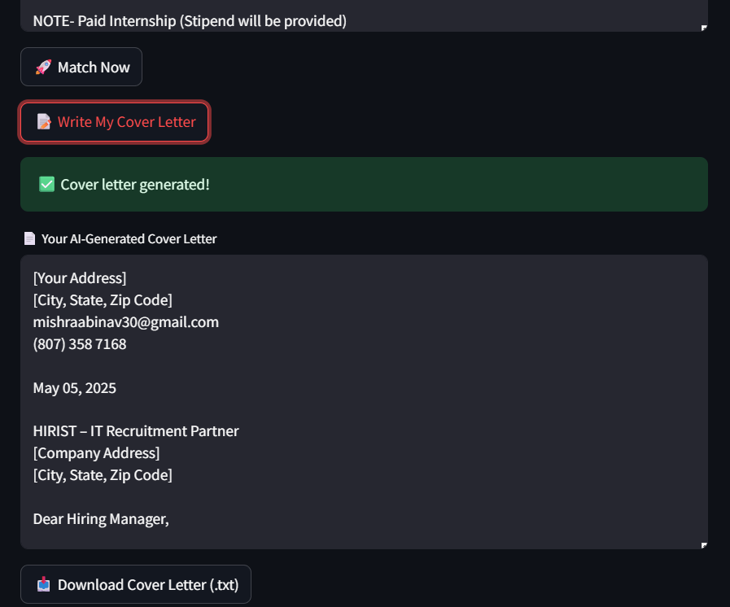

# 🔍 JobFit AI – Resume & Job Description Matcher

**JobFit AI** is a Streamlit-powered web app that helps job seekers instantly assess how well their resume matches a given job description — and then generates a personalized, professional cover letter using OpenAI's GPT models.

🌟 **MATCH SCORE**
🧠 **SKILL EXTRACTION & COMPARISON**
📄 **COVER LETTER GENERATOR (WITH DOWNLOAD)**
📅 **RESUME SECTION COMPLETENESS CHECK**

---

## 🚀 FEATURES

* ✅ **PDF Resume Upload**
* 📋 **Smart Skill Matching** using spaCy & sentence transformers
* 📊 **Match Score** calculated via semantic similarity
* 🔍 **Verified Skill Gap Detection** from official ESCO + custom list
* 🧠 **GPT-Powered Cover Letter Generator** using `gpt-4`
* 📄 **Download Cover Letter (.txt)**
* 🧑 **Auto-extract Contact Info** (name, email, phone) from resume
* ✨ **Clean, responsive Streamlit UI**

---

## 📂 FOLDER STRUCTURE

```
📁 24-hours-selfHackathon/
🔼 main.py                 # Streamlit main app
🔼 utils/
   └︎ nlp_utils.py        # (Optional future refactoring)
🔼 skills_en.csv           # ESCO skillset
🔼 custom_skills.csv       # Custom skillset (editable)
🔼 .streamlit/
   └︎ secrets.toml        # API key config
🔼 requirements.txt        # Dependencies
🔼 README.md
```

---

## ⚙️ SETUP INSTRUCTIONS

1. **Clone the Repo**

```bash
git clone https://github.com/your-username/jobfit-ai.git
cd jobfit-ai
```

2. **Set up Virtual Environment**

```bash
conda create -n spacy-env python=3.10
conda activate spacy-env
```

3. **Install Requirements**

```bash
pip install -r requirements.txt
```

4. **Add OpenAI API Key**

Create a file at `.streamlit/secrets.toml`:

```toml
OPENAI_API_KEY = "your-api-key-here"
```

5. **Run the App**

```bash
streamlit run main.py
```

---

## 📦 DEPENDENCIES

* `streamlit`
* `openai`
* `sentence-transformers`
* `spacy`
* `pdfplumber`
* `pandas`

---

## 🧐 HOW IT WORKS

* Your resume and the job description are vectorized via `MiniLM` transformer
* Skills are extracted using `spaCy` and validated against known datasets
* Match score is calculated with cosine similarity
* GPT-4 generates a tailored cover letter using job and resume context

---

## 📸 SCREENSHOTS

| Resume Upload & JD Input          | Cover Letter Output             |
| --------------------------------- | ------------------------------- |
|  |  |


---

## 💡 CREDITS

Created with ❤️ by **Abhinav Mishra**
Inspired by a **24-Hour Self Hackathon Project Challenge** 🚀
